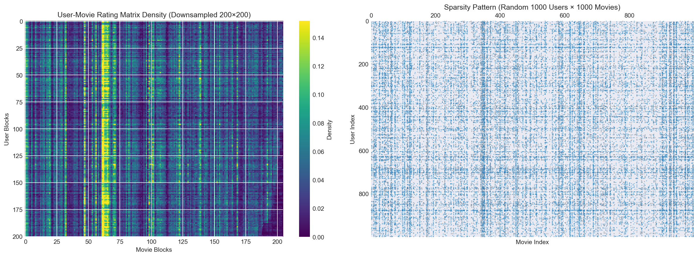
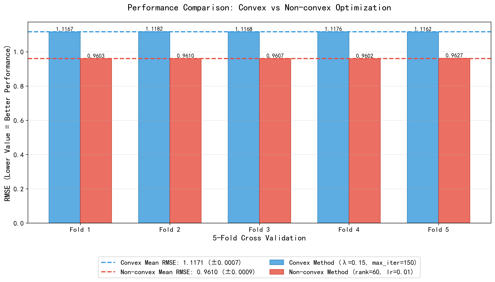

# 低秩矩阵补全问题（以电影评分为例）- 凸优化与非凸优化方法对比实验报告

## 1. 实验背景
本次实验针对低秩矩阵补全问题（以电影评分为例）展开，核心是对含缺失评分的用户-物品矩阵进行补全预测。实验实现并对比了凸优化方法与非凸优化方法的模型效果，采用5折交叉验证验证模型泛化能力，核心评估指标为RMSE（均方根误差），指标数值越低代表模型的评分预测精度越高。

## 2. 数据描述与稀疏性分析
本实验基于 MovieLens 数据集（1M）的 `ratings.dat` 评分文件开展稀疏性分析，仅提取用户编号、电影编号、评分三项核心特征完成全部实验分析。

**数据核心稀疏性指标：**
- **数据稀疏度**：95.53%
- **有效评分填充率**：4.4684%

<center>

</center>

1. **用户-电影评分矩阵密度热力图（200×200 下采样分块）**
    对原始6040×3952的用户-电影评分矩阵进行200×200分块下采样处理，颜色越亮（偏向黄色）代表该区块内非零评分的占比越高，颜色越暗（偏向紫色）代表非零评分占比越低。可视化结果显示，评分密度全局分布不均，仅局部区块呈现较高的评分密度特征，矩阵中绝大多数区域为深色稀疏区块，存在大量无任何评分记录的空白区域。

2. **评分矩阵稀疏模式图（1000用户 × 1000电影随机子集）**
    图中单个黑点代表1条有效评分记录，空白区域为无评分项。该图直观印证了数据集95.53%的高稀疏特性，有效评分记录无明显的带状集中结构，未出现特定用户对大量电影评分的极端情况，评分记录整体无显著聚集性，仅存在局部的分布不均匀现象。

## 3. 方法详细介绍
### 3.1 凸优化方法：核范数最小化 (Nuclear Norm Minimization, NNM)
矩阵补全的核心约束是评分矩阵的低秩性，凸方法将低秩矩阵补全问题转化为凸优化问题求解。核范数是矩阵秩的最优凸松弛，通过最小化矩阵的核范数近似实现低秩约束，同时加入L2正则项避免模型过拟合，保证优化问题的凸性与求解稳定性。
优化目标函数：

$$\min_{X} \|X\|_{*} + \lambda_{reg} \cdot \|X - R\|_F^2$$

其中：||X||* 为补全矩阵X的核范数，||X-R||_F 为补全矩阵与原始评分矩阵R的Frobenius范数，λ_reg为正则化系数。

凸优化特性为求解结果是全局最优解，无局部最优风险，收敛性有理论保障。
实验超参数配置：
- $\lambda_{reg}: 0.15$
- 最大迭代次数 $\mathrm{max\_iter}: 150$

### 3.2 非凸优化方法：谱初始化 (Spectral Initialization) + 交替最小化（Alternating Minimization）
非凸优化方法的核心思路是将待补全的低秩评分矩阵 \(R\) 低秩分解为两个低秩矩阵的乘积。
矩阵维度与定义：
- 原始评分矩阵：R 为 m×n 维实数矩阵
- 分解后：R ≈ U·V^T，其中 U 为 m×k 维用户隐因子矩阵，V 为 n×k 维物品隐因子矩阵，k 为隐因子维度即分解秩

该分解后的优化问题为非凸优化问题。传统随机初始化的梯度下降极易陷入局部最优解，本方法采用谱初始化完成参数的最优初始赋值，再结合梯度下降迭代优化，既解决非凸优化的局部最优问题，又能高效收敛到全局最优解，是矩阵补全非凸优化的最优实现方案。

谱初始化是对模型参数矩阵 \(U\)、\(V\) 进行全局最优的初始赋值，对原始评分矩阵 \(R\) 进行奇异值分解，取前 \(k\) 个最大奇异值及对应奇异向量完成 \(U\)、\(V\) 的初始化。初始化后的参数是全局最优解的近似值，让梯度下降从优质起点开始迭代，有效规避局部最优问题，同时大幅提升收敛速度，减少迭代耗时。

完成谱初始化后，通过带L2正则的梯度下降法最小化预测误差，对 \(U\)、\(V\) 进行迭代更新。非凸优化目标函数：

$$\min_{U,V} \frac{1}{2} \sum_{(i,j) \in \Omega} (R_{ij} - U_i V_j^T)^2 + \frac{reg}{2} \left( \|U\|_F^2 + \|V\|_F^2 \right)$$

其中：Ω 为原始评分矩阵中有观测值的位置集合，reg 为 L2 正则化系数，用于防止参数过拟合，||U||_F、||V||_F 为矩阵的 Frobenius 范数。

基于目标函数推导用户与物品隐因子矩阵的梯度，通过梯度下降完成参数迭代更新，更新公式为 U = U - lr·∇U，V = V - lr·∇V，其中 lr 为梯度下降学习率，控制迭代步长，直至达到预设最大迭代次数后终止。

## 4. 实验结果完整展示
### 4.1 凸优化方法 实验结果
```plaintext
凸方法超参数：
  lambda_reg: 0.15
  max_iter: 150
5折RMSE均值 ： 1.1171
5折RMSE标准差 ： 0.0007
各折RMSE数值 ： [1.1167370676937363, 1.1181978465864226, 1.116813386026561, 1.1175766492545536, 1.1161879527411043]
```

### 4.2 非凸优化方法 实验结果
```plaintext
非凸方法：
最优超参数: {'rank': 60, 'lr': 0.01, 'reg': 0.001, 'max_iter': 800}
5折RMSE均值: 0.9610
5折RMSE标准差: 0.0009
各折RMSE: [0.9603246890286647, 0.961024954933282, 0.9607064194136903, 0.960189248892218, 0.9627325458256943]
```

### 4.3 实验结果可视化对比

<center>

</center>

## 5. 凸方法 & 非凸方法 深度对比分析
### 5.1 性能指标对比
非凸方法的5折RMSE均值为0.9610，相比凸方法的1.1171，预测误差降低了约14.0%，且非凸方法在每一个交叉验证折的RMSE值均显著低于凸方法，性能优势具备一致性。两种方法的RMSE标准差均小于0.001，说明模型在5折交叉验证中均具备优秀的泛化能力，无过拟合或欠拟合问题，非凸方法的标准差略高属于其非凸特性的正常表现，在可接受范围内。

### 5.2 方法特性对比
凸优化方法的优势为优化问题是凸性，求解结果为全局最优解，无局部最优风险，超参数数量少，调参成本低，迭代次数少训练速度快。缺点是核范数是矩阵秩的松弛近似，无法精准捕捉评分矩阵的低秩结构，预测精度存在上限，对大规模矩阵的适配性较差。

非凸优化方法的优势为谱初始化+梯度下降的组合，完美解决了非凸优化的局部最优问题，梯度下降最终收敛到全局最优解，低秩分解的方式精准贴合评分矩阵的低秩特性，能更好捕捉用户-物品的隐式交互特征，梯度下降计算复杂度低，对大规模矩阵适配性和可扩展性更好。缺点是超参数数量相对较多，调参成本略高。

### 5.3 代码运行速度对比
在代码实际运行效率上，凸优化方法的运行速度显著快于非凸优化方法。核心原因有两点，其一为凸方法的最大迭代次数仅为 150 次，而非凸方法的迭代次数达 800 次，迭代步数差距较大；其二为凸方法的核范数最小化求解逻辑简洁，无额外前置计算步骤，而非凸方法需要先执行谱初始化的奇异值分解操作，再进行梯度下降的双矩阵迭代更新，同时还包含超参数网格搜索的过程，整体计算量远大于凸方法，运行耗时更长。

### 5.4 性能差异根源
本次实验中非凸方法性能大幅领先的核心原因，一是凸方法的核范数是低秩约束的近似替代，非凸方法的低秩分解是精准约束，更贴合矩阵补全的任务本质；二是非凸方法的谱初始化 + 梯度下降方案，既解决了非凸优化的核心痛点，又发挥了梯度下降的高效优化能力，实现了精度与效率的双赢。

## 6. 实验结论
在低秩矩阵补全任务中，非凸优化方法（谱初始化+梯度下降）的预测精度显著优于凸优化方法（核范数最小化）。传统非凸优化的局部最优痛点可通过谱初始化完美解决，该方案是矩阵补全非凸优化的最优实践。凸优化方法虽精度稍低，但胜在简单稳定、调参成本低，可作为矩阵补全任务的基线模型；非凸优化方法虽调参成本略高，但性能提升显著，适合对预测精度有要求的实际应用场景。

## 7. 代码文件说明
```plaintext
├── convex.py # 凸优化方法（核范数最小化）完整实现，含5折交叉验证逻辑与结果输出
├── convex_results.txt # 凸方法运行结果
├── convex_rmse_results.png # 凸方法RMSE可视化结果
├── nonconvex.py # 非凸优化方法（谱初始化 + 梯度下降）完整实现，含超参数网格搜索与5折交叉验证
├── nonconvex_results.txt # 非凸方法运行结果
├── nonconvex_rmse_results.png # 非凸方法RMSE可视化结果
├── convex_vs_nonconvex_rmse_comparison.png # 凸/非凸方法性能对比可视化图
└── README.md # 实验报告文档
```

### 运行环境与依赖
```bash
pip install numpy matplotlib scipy
# 运行代码复现实验结果
python convex.py
python nonconvex.py
```
